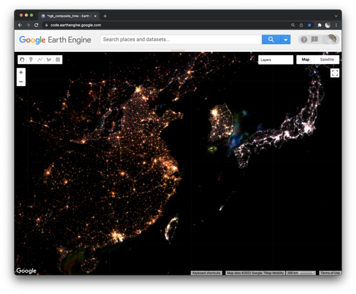

## RGB change composite    

_Adapted from: 'Exploring images' by J. Howarth in 'Cloud-based Remote Sensing with Google Earth Engine'. Edited by J. Cardille, N. Clinton, M. Crowley, D. Saah. Springer. Summer 2022._

In this lesson, we create a multi-band image for three slices of time and then visualize change with additive color.  



_Figure 1. RGB composite of stable nighttime lights in 2013 (red channel), 2003 (green channel), and 1993 (blue channel)._    

### Load the dataset

```js
// Load a 1993 nighttime lights dataset from its Earth Engine ID.
var lights93 = ee.Image('NOAA/DMSP-OLS/NIGHTTIME_LIGHTS/F101993');

// Print image metadata to the Console.
print('Nighttime lights', lights93);
```
<br>
<details>
<summary><b>Check your understanding.</b></summary>
<br>
<li>How many <b>bands</b> does this image contain?</li>
<br>
<li>How does the <b>image extent</b> differ from the previous image we explored?
</details>

### Inspect the catalog description  

Please find and inspect the data catalog description for this dataset.  

In addition, examine the data provider information.  

<details>
<summary><b>Check your understanding.</b></summary>
<br>
<li>What is the <b>pixel scale</b> of this image?</li>
<br>
<li>How does the <b>avg_vis</b> band differ from the <b>stable_lights</b> band?
</details>

### Explore image with histogram  

```js
// Import module for image processing.
var image_tools = require('users/jhowarth/eePrimer:modules/image_tools.js');

// Construct histogram chart.
var histogram = image_tools.makeBoundedHistogram(
  geometry,            //  region (because image is unbounded)
  XXXXXXXX,           //  use data from this image
  XXXXXXXX,           //  select this band
  XXXX,               //  use this scale (same as image)
  0,                  //  min value of x-axis
  100,                //  max value of x-axis
  0,                   //  min value of y-axis
  30000                //  max value of y-axis
  );

// Inspect the chart object in the Console.
print(histogram);

```

<details>
<summary><b>Check your understanding.</b></summary>
<br>
<li>What does the histogram show you about the image data?</li>
</details>


### Add map layer  

```js
// Display the 'stable_lights' band as a map layer.
Map.addLayer(
    XXXXX,
    {
      bands: ['stable_lights'],
      min: XXXX,
      max: XXXX
    },
    '1993 stable lights');
```

<details>
<summary><b>Check your understanding.</b></summary>
<br>
<li>What happens if you increase the min or decrease the max values of the visualization parameters? Why? </li>
</details>

### Gather images  

```js
// Construct an image of stable lights for 2003.
var lights03 = ee.Image('NOAA/DMSP-OLS/NIGHTTIME_LIGHTS/F152003')
    .select('stable_lights')    //  Select this band from lights03
    .rename('2003');            //  Give band this name  

print('lights 2003', lights03);

// Construct an image of stable lights for 2013.
var lights13 = ee.Image('NOAA/DMSP-OLS/NIGHTTIME_LIGHTS/F182013')
    .select('stable_lights')    //  Select this band from lights 13
    .rename('2013');            //  Rename band

print('lights 2013', lights13);
```

<details>
<summary><b>Check your understanding.</b></summary>
<br>
<li>What did the <b>.rename()</b> function do?</li>  
<br>
<li>Please draw a <b>flow chart</b> that depicts how we processed each image.</li>
</details>

### Add bands to an image

```js
// Construct an image with three bands,
// where each band represents stable lights for one year.

var changeImage = lights13      //  lights13 as first band
    .addBands(lights03)         //  Add band from lights03 as second band
    .addBands({                 //  Add band from lights93 as third band
      srcImg: lights93          
        .select('stable_lights')//  Select this band from lights93
        .rename('1993')         //  Rename the band.
    });

// Print image metadata to the Console.
print('change image', changeImage);
```

<details>
<summary><b>Check your understanding.</b></summary>
<br>
<li>How many bands does <b>changeImage</b> contain,  what are they named, and what is their sequence?</li>  
<br>
<li>Please draw a <b>flow chart</b> that depicts how we produced <b>changeImage</b>.</li>
</details>

### Visualize change as RGB composite  

```js
// Add an RGB composite layer tothe Map.
Map.addLayer(
    changeImage,
      {
      min: 0,
      max: 63
      },
    'Change composite');

```

[Explore changes in nighttime lights](../articles/rgbLights/lights.md)
