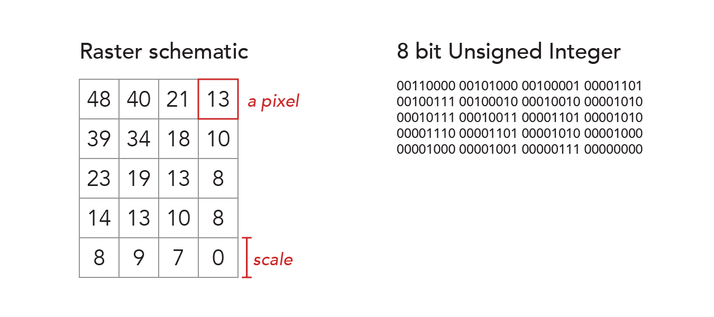

## Image bands  

_Adapted from: 'Exploring images' by J. Howarth in 'Cloud-based Remote Sensing with Google Earth Engine'. Edited by J. Cardille, N. Clinton, M. Crowley, D. Saah. Springer. Summer 2022._

In this lesson, we explore how to inspect and visualize data stored in image bands.  


<br>_Figure 1. Band 1 visualized as a map layer._


### Start script with a header

```js
//  ~~~~~~~~~~~~~~~~~~~~~~~~~~~~~~~~~~~~~~~~~~~~~~~~~~~~~~~~~~~~~~~~~~~~~~~
//  Title:        Image bands
//  Author:       Jeff Howarth
//  Last edited:  1/10/2022   
//          
/* In this lesson, we explore how to inspect and visualize data stored in image bands.  */  
// ~~~~~~~~~~~~~~~~~~~~~~~~~~~~~~~~~~~~~~~~~~~~~~~~~~~~~~~~~~~~~~~~~~~~~~~
```

<details>
<summary><b>Check your understanding.</b></summary>
<br>
What purpose(s) does a header serve?
</details>  

### Load an image  

```js
// Load an image from its Earth Engine ID.
var first_image = ee.Image('LANDSAT/LT05/C02/T1_L2/LT05_118038_20000606');

// Inspect the image object in the Console.
print(first_image);  

// Inspect the first band in the Console.
print('Band 1', first_image.select('SR_B1'));
```
  
<br>_Figure 2. Raster data model_

<details>
<summary><b>Check your understanding.</b></summary>
<br>
<li>What is an <b>image</b> and why does an image contain <b>bands</b>?</li>
<br>
<li>How does an image <b>band</b> differ from an image <b>property</b>?</li>
<br>
<li>What does the <b>image.select()</b> method do?</li>
</details>  

### Inspect catalog description  

1. Copy the image path from the Earth Engine Id.

```js
'LANDSAT/LT05/C02/T1_L2/'
```

2. Paste the path into the __Search__ panel.  

3. Open the __catalog description__ for the data collection.  

<details>
<summary><b>Check your understanding.</b></summary>
<br>
How does this data description differ from the information that you printed to the <b>Console</b> in the previous step?
</details>    

### Chart histogram of image data  

```js
// Import module for image processing.
var image_tools = require('users/jhowarth/eePrimer:modules/image_tools.js');

// Construct histogram chart.
var histogram_b1 = image_tools.makeHistogram(
  first_image,  //  use data from this image
  'SR_B1',      //  select this band
  30,           //  use this scale (same as image)
  0,            //  min value of x-axis
  20000);       //  max value of x-axis

// Inspect the chart object in the Console.
print(histogram_b1);

```
<details>
<summary><b>Check your understanding.</b></summary>
<br>
<li>What does the histogram show you about the image data?</li>
</details>

### Display band as map layer  

```js
// Center the Map on the image prior to adding layers to the Map.
Map.centerObject(first_image, 10);

// Display band 1 of the image as the first map layer.
Map.addLayer(
    first_image,            //  dataset to display
    {
      bands: ['SR_B1'],     //  band to display
      min: 8000,            //  display range  
      max: 17000           
    },
    'Layer 1'               //  name to show in Layer Manager
);    
```
<details>
<summary><b>Check your understanding.</b></summary>
<br>
<li>Using the <b>Inspector</b>, click on a location, and look under the <b>Pixels</b> carrot. Click the blue icon to toggle between chart and dictionary views of the data. What does this data tell you about the location that you clicked?</li>
<br>
<li>Comment out the <b>min</b> and <b>max</b> display range values of the <b>visualization parameters</b>, then run the code again. Why does your image look so different? What do the min and max keys of the visualization parameters do?
</details>

### Display bands 2 and 3 as layers  

```js
// Display band 2 as the second map layer.
Map.addLayer(
    first_image,
    {
      bands: ['SR_B2'],
      min: 8000,
      max: 17000
    },
    'Layer 2',
    0,                      //  shown
    1                       //  opacity
);

// Display band 3 as the third map layer.
Map.addLayer(
    first_image,
    {
      bands: ['SR_B3'],
      min: 8000,
      max: 17000
    },
    'Layer 3',
    1,                      //  shown
    0                       //  opacity
);
```

<details>
<summary><b>Check your understanding.</b></summary>
<br>
<li>What additional arguments did we pass to the <b>Map.addLayer()</b> function and what did they do?</li><br>
<li>How does the order of <b>Map.addLayer()</b> functions in your script correspond to the order of <b>layers</b> on the map? Why is this so?</li>
</details>
