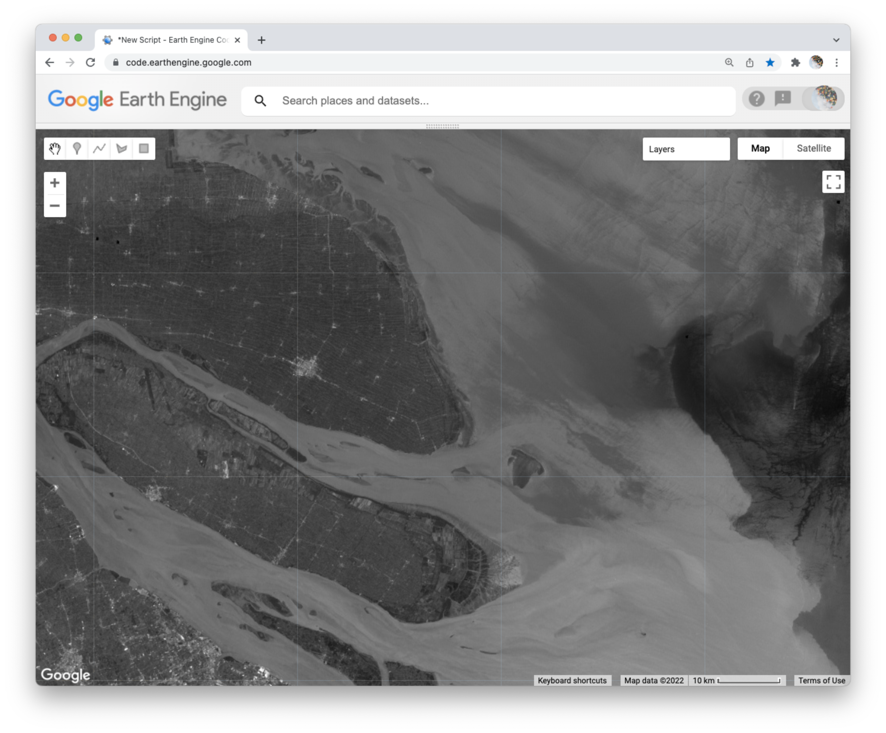
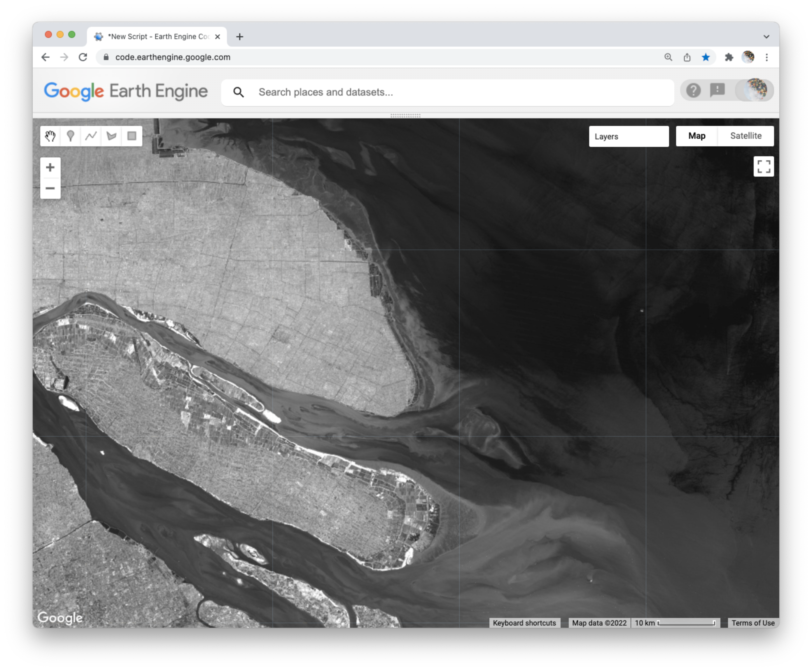

## Displaying image bands  

_Adapted from: 'Exploring images' by J. Howarth in 'Cloud-based Remote Sensing with Google Earth Engine'. Edited by J. Cardille, N. Clinton, M. Crowley, D. Saah. Springer. Summer 2022._

In this lesson, we explore how to inspect and visualize data stored in image bands. You will learn how to load an image with an Earth Engine ID, select bands, display histograms, and add bands as layers to the Map UI. You will also learn how to apply information in the histogram to improve the visual contrast of the map layer through stretch enhancement.      


<br>_Figure 1. Band 1 visualized as a map layer._


### Start script with a header

```js
//  ~~~~~~~~~~~~~~~~~~~~~~~~~~~~~~~~~~~~~~~~~~~~~~~~~~~~~~~~~~~~~~~~~~~~~~~
//  Title:        Displaying image bands
//  Author:       Jeff Howarth
//  Last edited:  2/21/2022   
//          
/* In this lesson, we explore how to inspect and visualize data stored in image bands. You will learn how to construct an image with an Earth Engine ID, select bands, display histograms, and add bands as layers to the Map UI. You will also learn how to apply information in the histogram to improve the visual contrast of the map layer through stretch enhancement. */  
// ~~~~~~~~~~~~~~~~~~~~~~~~~~~~~~~~~~~~~~~~~~~~~~~~~~~~~~~~~~~~~~~~~~~~~~~
```

<details>
<summary><b>Check your understanding.</b></summary>
<br>
What purpose(s) does a header serve?
</details>  

### Load an image  

```js
// Load an image from its Earth Engine ID.
var first_image = ee.Image('LANDSAT/LT05/C02/T1_L2/LT05_118038_20000606');

// Inspect the image object in the Console.
print(first_image);  

// Inspect the first band in the Console.
print('Band 1', first_image.select('SR_B1'));
```
  
<br>_Figure 2. Raster data model_

<details>
<summary><b>Check your understanding.</b></summary>
<br>
<li>What is an <b>image</b> and why does an image contain <b>bands</b>?</li>
<br>
<li>How does an image <b>band</b> differ from an image <b>property</b>?</li>
<br>
<li>What does the <b>image.select()</b> method do?</li>
</details>  

### Inspect catalog description  

1. Copy the image path from the Earth Engine Id.

```js
'LANDSAT/LT05/C02/T1_L2/'
```

2. Paste the path into the __Search__ panel.  

3. Open the __catalog description__ for the data collection.  

<details>
<summary><b>Check your understanding.</b></summary>
<br>
What information can you find in the catalog description that was not provided when you printed the image to the <b>Console</b> in the previous step?
</details>    

### Chart histogram of image data  

```js
// Import module for image processing.
var image_tools = require('users/jhowarth/eePrimer:modules/image_tools.js');

// Construct histogram chart.
var histogram_b1 = image_tools.makeHistogram(
  first_image,  //  use data from this image
  'SR_B1',      //  select this band
  30,           //  use this scale (same as image band)
  0,            //  min value of x-axis
  20000);       //  max value of x-axis

// Inspect the chart object in the Console.
print(histogram_b1);

```
<details>
<summary><b>Check your understanding.</b></summary>
<br>
<li>Using the words 'data value' and 'count', explain what the histogram shows you about the image?</li>
</details>

### Display band 1 as map layer  

```js
// Center the Map on the image prior to adding layers to the Map.
Map.centerObject(first_image, 10);

// Display band 1 of the image as the first map layer.
Map.addLayer(
    first_image,            //  dataset to display
    {
      bands: ['SR_B1'],     //  band to display
      min: 8000,            //  display range  
      max: 14000           
    },
    'Band 1'               //  name to show in Layer Manager
);    
```
<details>
<summary><b>Check your understanding.</b></summary>
<br>
<li>Using the <b>Inspector</b>, click on a location, and look under the <b>Pixels</b> carrot. Click the blue icon to toggle between chart and dictionary views of the data. What does this data tell you about the location that you clicked?</li>
<br>
<li>Comment out the <b>min</b> and <b>max</b> display range values of the <b>visualization parameters</b>, then run the code again. Why does your image look so different? What do the min and max keys of the visualization parameters do?</li>
</details>

### Inspect and display band 2  

Please copy and paste these code snippets, replace each XXXX parameter with the correct value, and run the code.    

```js
// Construct histogram chart for band 2.
var histogram_b2 = image_tools.makeHistogram(
  XXXX,         //  use data from this image
  XXXX,         //  select this band
  30,           //  use this scale (same as image band)
  0,            //  min value of x-axis
  20000);       //  max value of x-axis

// Inspect the chart object in the Console.
print(histogram_b2);
```

Please inspect the chart and write down the data range. Then copy and paste the code below, replace each XXXX parameter with a good value, and run the code.  

```js
// Display band 2 as the second map layer.
Map.addLayer(
    first_image,
    {
      bands: XXXX,
      min: XXXX,
      max: XXXX
    },
    'Band 2'
);
```

<details>
<summary><b>Check your understanding.</b></summary>
<br>
<li>How does your choice of min and max display values affect the layer's visual contrast?</li>
<br>
<li>Please define <b>stretch enhancement</b>.</li>
</details>

### Inspect and display band 3

Please copy and paste this code into the Code Editor, replace each XXXX parameter with the correct value, and run the script.    

```js
// Construct histogram chart for band 2.
var histogram_b2 = image_tools.makeHistogram(
  XXXX,         //  use data from this image
  XXXX,         //  select this band
  XXXX,         //  use this scale (same as image band)
  0,            //  min value of x-axis
  20000);       //  max value of x-axis

// Inspect the chart object in the Console.
print(histogram_b2);
```

Same drill with the code below: replace XXXX paramters with good values and run the script.  

```js
// Display band 3 as the third map layer.
Map.addLayer(
    first_image,
    {
      bands: XXXX,
      min: XXXX,
      max: XXXX
    },
    'Band 3',
    0,                      //  shown
    0                       //  opacity
);
```

<details>
<summary><b>Check your understanding.</b></summary>
<br>
<li>What additional arguments did we pass to the <b>Map.addLayer()</b> function and what did they do?</li><br>
<li>How does the order of <b>Map.addLayer()</b> functions in your script correspond to the order of <b>layers</b> on the map? Why is this so?</li>
</details>

### Inspect and display band 4  

Work with a partner and write out a script from scratch that displays band 4 with good contrast. Your result should look similar to Figure 3.  


<br>_Figure 3. Band 4 visualized as a map layer._


### Further reading  

[Landsat missions: Landsat 5](https://www.usgs.gov/landsat-missions/landsat-5)
