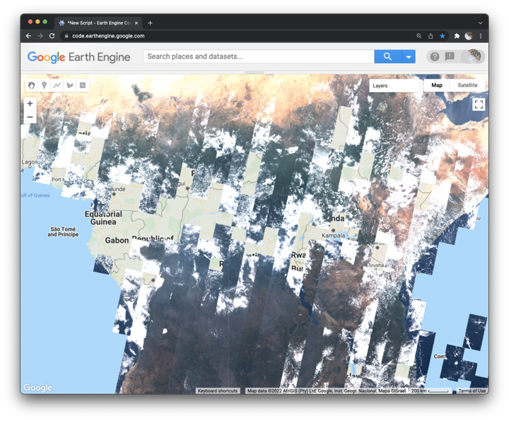

## Image collections  

In this lesson, we investigate how to work with image collections in Earth Engine. You learn how to load an image collection, select the first image in the stack, and filter the collection by time and location. We use the Landsat 8 collection to demonstrate these methods. You see how many days it takes the satellite to image our planet's entire surface and how many times the same location has been imaged over the satellite's mission. We also learn how to reduce an image collection to an image with local operations.  

  

_Figure 1. Landsat 8 scenes collected between June 9 - 25, 2014 for equatorial Africa._  

### Start a new script

```js
//  ~~~~~~~~~~~~~~~~~~~~~~~~~~~~~~~~~~~~~~~~~~~~~~~~~~~~~~~~~~~~~~~~~~~~~~~
//  Title:        Image collections
//  Author:       Jeff Howarth
//  Last edited:  1/11/2022   
// ~~~~~~~~~~~~~~~~~~~~~~~~~~~~~~~~~~~~~~~~~~~~~~~~~~~~~~~~~~~~~~~~~~~~~~~

/*  In this lesson, we investigate how to work with image collections
    in Earth Engine. You will learn how to load an image collection,
    select the first image in the stack, and filter the collection by
    time and location. We use the Landsat 8 collection to demonstrate
    these methods. We see how many days it takes the satellite to image
    the planet's entire surface and how many times the same location has
    been imaged over the satellite's mission. We also learn how to reduce
    an image collection to an image with math operations. */   
```

### Import Landsat 8 image collection  

```js
// Import the Landsat 8 collection
// (Level 2, Collection 2, Tier 1 and Real-Time data Raw Scenes).
var L8 = ee.ImageCollection("LANDSAT/LC08/C01/T1_RT");

// Print the size of the L8 dataset.
// print('The size of L8 is: ', L8.size());
```
<details>
<summary><b>Check your understanding.</b></summary>
<br>
What is the <b>date range</b> of this image collection?
</details>  

### Select first image in stack  
```js
// Print the first image in the collection.
print('First image in collection:', L8.first());
```
<details>
<summary><b>Check your understanding.</b></summary>
<br>
How do the <b>band numbers</b> of the L8 images differ from the band numbers of the L5 image we worked with a previous lesson?
</details>

### Filter by date range  

```js
// Filter collection by a date range.
var L8_filtered = L8.filterDate('2014-06-09','2014-06-10');

// Print size of filtered collection.
print('Size of filtered collection:', L8_filtered.size());
```

<details>
<summary><b>Check your understanding.</b></summary>
<br>
How many images does the Landsat 8 satellite capture in a single day?
</details>

### Add layer to map  

```js
// Center map on equatorial Africa.
Map.setCenter(25,0,5);

// Add the L8 dataset to the map
Map.addLayer(
  L8_filtered,
    {
    bands: ['B4','B3','B2'],
    min: 5000,
    max: 15000
    },
  'Landsat 8 Image Collection');
```

<details>
<summary><b>Check your understanding.</b></summary>
<br>
<li>How many days does it take for the Landsat 8 satellite to capture images for every location on the planet's surface?</li>
<br>
<li>Why do you think some images are missing from this collection?</li>
</details>

### Filter by location  

_Please note: insert this code block after the **Filter by date block** and before the **Add layer block**_.

```js
// Construct a point object.  
var point = ee.Geometry.Point([29.590382,-1.387945]);

// Filter collection by a location
var L8_filtered = L8
  .filterBounds(point)
  // .select('B4','B3','B2')
  // .min()                   // reduce pixel values [also try .median(), .max(), .mode()]
  ;

```

<details>
<summary><b>Check your understanding.</b></summary>
<br>
<b>Before you reduce the image,</b> please use the <b>Inspector panel</b>, click on a location and inspect the chart under the <b>Pixels - Series</b> carrot.
<br><br>
<li>What does the chart show?</li>
<br>
<li>What do you think causes the peaks and valleys in the lines?</li>
<br>
<b>After you reduce the image:</b><br>
<br>
<li>Why does <b>.max()</b> make the scene appear all white?</li>
<br>
<li>Why do white patches with colorful noise remain in the scene when we reduce with <b>.mode()</b>.</li>
<br>
<li>Why are .min(), .max(), .median(), and .mode() called <b>local operations</b>?</li>
</details>


### Further reading
<br>

[Landsat missions: Landsat 8](https://www.usgs.gov/landsat-missions/landsat-8)

[What are the acquisition schedules for the Landsat satellites?](https://www.usgs.gov/faqs/what-are-acquisition-schedules-landsat-satellites)
