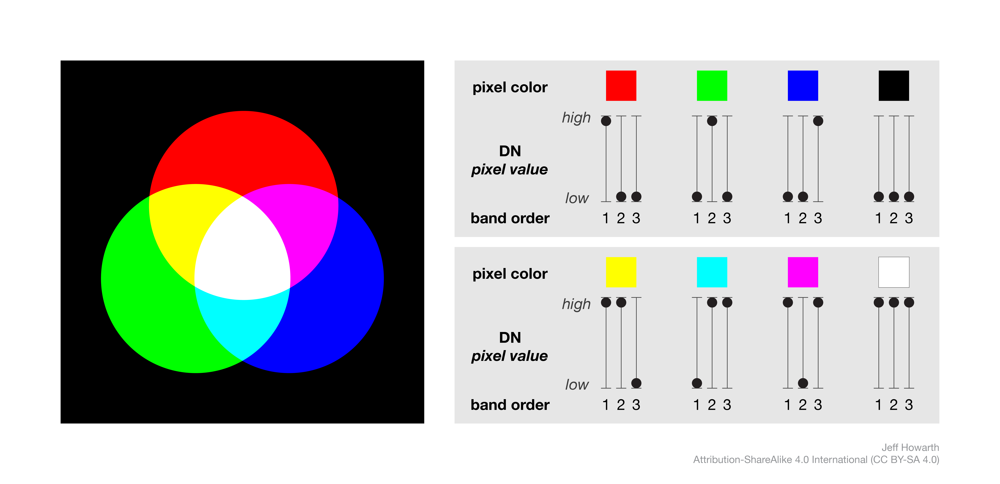
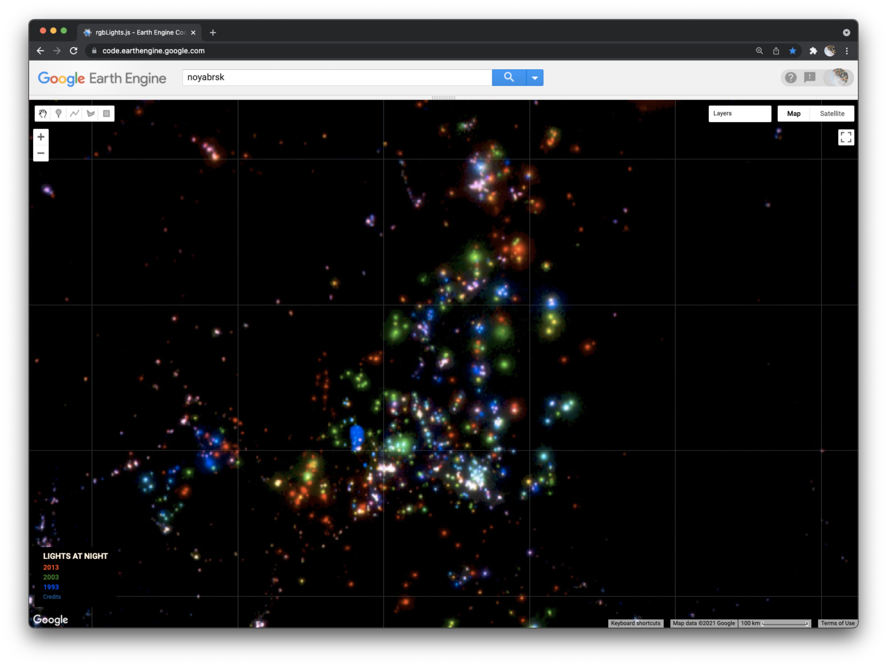
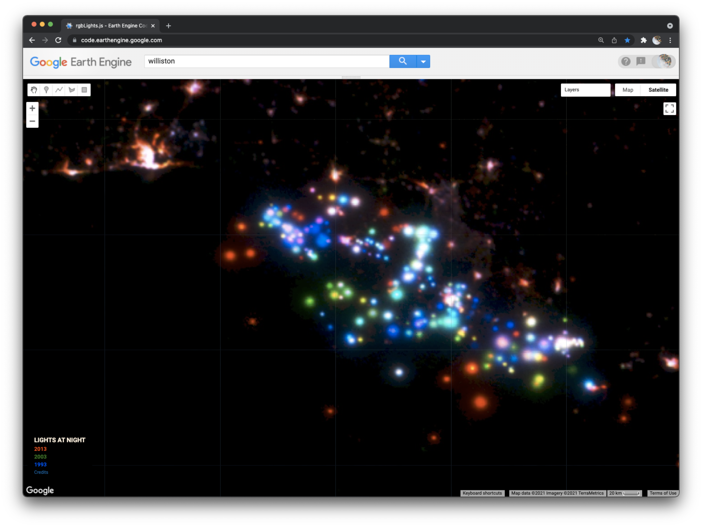

## RGB of stable nighttime lights (1993 - 2013)  

[_Earth Engine script_](rgbLights.js)  

This image uses additive color to compare brightness of stable nighttime lights in 2013, 2003, 1993.  

- Red channel = 2013  
- Green channel = 2003  
- Blue channel = 1993     

If you are new to reading additive color, the picture below illustrates how colors represent combinations of pixel values.

  

## Heat pattern  

The picture of Shanghai, China shows a recurring pattern that resembles heat from a fire: white core, yellow periphery, red terminal edge.  

  

This pattern often shows urban sprawl. Locations with bright stable lights in all three years appear white. Locations that became bright in 2003 and remained bright in 2013 appear yellow. Locations that became bright in 2013 appear red.   

## Holiday lights pattern

In many places, bright dots of many different colors appear near each other and resemble holiday lights. These represent places with bright lights that were stable for a year, but not stable for a decade or more. These often mark places of fossil fuel extraction. Some examples include:  

#### Noyabrsk, Russia  

  

#### Yenagoa, Nigeria  

  

## Aurora pattern    

Similar to the holiday lights pattern, some lights were were stable for a year but not for a decade, creating an aurora pattern. In comparison to the holiday light pattern, aurora patterns generally occur on the ocean and appear more diffuse. They are likely caused by shifts in the intensity of fishing activities that employ bright lights (like squid fishing).

#### Korea Strait

  

## Red Giants  

In some places, giant red patches of light appear, marking places that became bright in 2013 that had been dark in 2003 and 1993. These often mark large-scale fossil fuel extraction activities. The picture below shows examples of red giants in North Dakota and Texas.    

## National boundaries  

In a number of places, difference in nighttimes lights mark national boundaries. In the example above, South Korea appears as an island because of the darkness of North Korea. Some other interesting examples include:  

#### Lebanon - Israel

  

#### Pakistan - India  

  
